## Hi there 👋

## Tech Stack

    <code></code>
    <code></code>
    <code></code>
    <!-- <code></code> -->
    <code></code>
    <code></code>
    <code></code>
    <code></code>
    <code></code>
    <code></code>
    <code></code>
    <code></code>
    <code></code>
    <code></code>
    <!-- <code></code> -->
    <code></code>
    <!-- <code></code> -->
    <code></code>
    <code></code>
    <code></code>
    <!-- <code></code> -->
    <!-- <code></code> -->
    <!-- <code></code>
    <code></code> -->
    <!-- <code></code> -->
    <!-- <code></code> -->
    <!-- <code></code> -->
    <!-- <code></code> -->
    <!-- <code></code> -->
    <!-- <code></code> -->

<picture>
    <source media="(prefers-color-scheme: dark)" srcset="https://raw.githubusercontent.com/AlexLog94/AlexLog94/output/github-snake-dark.svg" />
    <source media="(prefers-color-scheme: light)" srcset="https://raw.githubusercontent.com/AlexLog94/AlexLog94/output/github-snake.svg" />
    
</picture>

<!-- 
 -->

<!-- 

 -->

<!--  -->
<!--  -->
